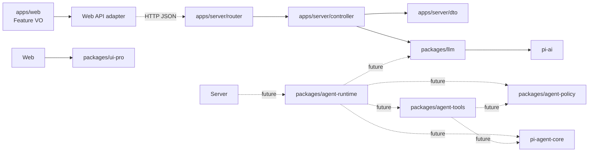
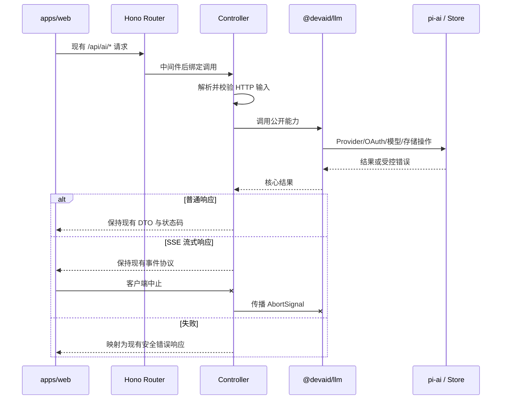
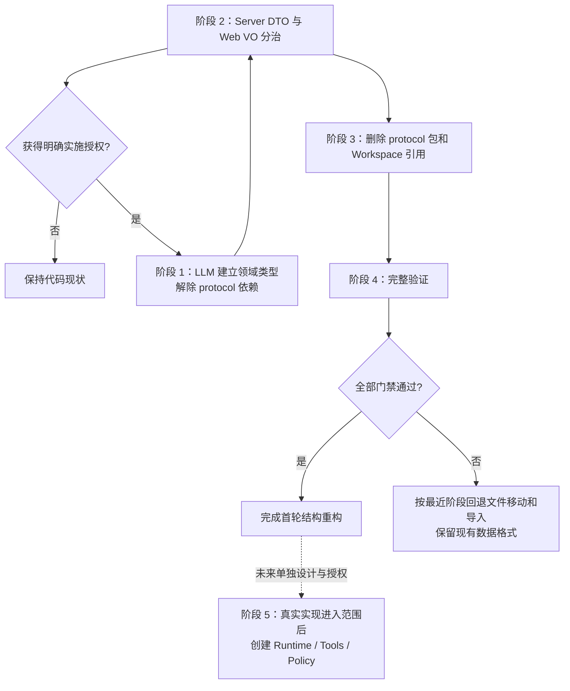

# Monorepo 核心架构重构

> [!important] 变更状态
> 用户已明确确认并授权移除临时 `packages/protocol`：Server 自持 DTO，Web 自持 VO，LLM 包只暴露领域类型。该收窄已完成，不改变既有 HTTP、数据与安全契约。

## 背景与目标

当前仓库已使用 `apps/web`、`apps/server` 和 `packages/ai-contracts`，但后端的 HTTP 路由、Provider、OAuth、存储和模型调用集中在 Server feature 中，能力归属与运行入口混在一起。目标是吸收 Pi 项目的 Package-first 思路，同时保留本项目已确认的 Hono 与显式 Controller 习惯：

1. Apps 只承载进程、HTTP/UI 适配和依赖装配。
2. 可复用核心能力按稳定职责进入 Packages。
3. Server 使用清晰的 Router、Controller 与核心包边界。
4. Runtime、Tools、Policy 相互独立，但不预建空包。
5. 重构期间保持现有 API、数据和安全行为兼容。

## 非目标

- 不迁移到 NestJS 或 Fastify，继续使用 Hono。
- 不在本轮引入 DI 容器、Repository 接口、Factory 体系或新构建工具。
- 不设计或实现尚未确认的 Agent Session、Run、审批、事件回放与恢复协议。
- 不调整 Web 产品交互，也不修改 `packages/ui-pro`。
- 不借目录重构修改现有 HTTP 路由、DTO 或本地存储格式。

## 重构前实现

```text
apps/
├── web/
└── server/
    └── src/features/ai/
        ├── routes/
        ├── providers.ts
        ├── model-service.ts
        ├── oauth-session-service.ts
        ├── credential-store.ts
        └── provider-config-store.ts

packages/
├── ai-contracts/
└── ui-pro/
```

当前 `apps/server/src/features/ai/` 同时承担 HTTP 适配、LLM 能力和本地持久化。`packages/ai-contracts` 只表达 AI HTTP 契约，名称过窄，不适合作为未来 Web、Server 与 Agent Runtime 的统一协议边界。

## 适用约束

- [[../../constraints/active#PRJ-0003]]：设计确认与实施授权分离。
- [[../../constraints/active#PRJ-0005]]：设计只写入项目 context Skill。
- [[../../constraints/active#PRJ-0007]]：`ui-pro` 不在重构范围。
- [[../../constraints/active#PRJ-0008]]：凭据存储、权限和脱敏不可退化。
- [[../../constraints/active#PRJ-0009]]：Provider、认证与模型仍由服务端白名单控制。
- [[../../constraints/active#PRJ-0010]]：状态、失败、兼容、回滚与验证必须显式记录。
- [[../../constraints/active#PRJ-0011]]：Apps、Server 分层和 Packages 边界按本文执行。

## 已确认方案

### 目标目录

```text
apps/
├── web/
│   └── src/
│       └── features/settings/models/
│           ├── api/
│           ├── data/
│           └── types/
│               └── provider-vo.ts
└── server/
    └── src/
        ├── main.ts                     # 启动进程
        ├── app.ts                      # Composition Root
        ├── config.ts
        ├── controller/
        │   ├── health/
        │   │   └── health-controller.ts
        │   ├── llm/
        │   │   ├── provider-controller.ts
        │   │   ├── oauth-controller.ts
        │   │   └── completion-controller.ts
        │   └── agent/                  # Agent HTTP 能力实际进入范围后创建
        │       ├── session-controller.ts
        │       └── run-controller.ts
        ├── dto/
        │   └── llm/
        │       ├── provider-dto.ts
        │       ├── oauth-dto.ts
        │       └── completion-dto.ts
        ├── router/
        │   ├── health/
        │   │   └── health-router.ts
        │   ├── llm/
        │   │   ├── provider-router.ts
        │   │   ├── oauth-router.ts
        │   │   └── completion-router.ts
        │   ├── agent/                  # Agent HTTP 能力实际进入范围后创建
        │   │   ├── session-router.ts
        │   │   └── run-router.ts
        │   └── index.ts
        └── middleware/
            ├── error/
            │   └── error-handler.ts
            └── request/
                └── request-limit.ts

packages/
├── llm/
│   └── src/
│       ├── model/
│       │   ├── llm-service.ts
│       │   └── model-types.ts
│       ├── provider/
│       │   ├── provider-registry.ts
│       │   ├── provider-config-store.ts
│       │   └── provider-types.ts
│       ├── auth/
│       │   ├── oauth-session-service.ts
│       │   ├── oauth-types.ts
│       │   └── credential-store.ts
│       ├── error/
│       │   └── llm-error.ts
│       └── index.ts
├── agent-runtime/                      # 有真实 Agent Loop 后创建
│   └── src/
│       ├── runtime/
│       ├── session/
│       ├── run/
│       ├── event/
│       ├── error/
│       └── index.ts
├── agent-tools/                        # 有真实内置工具后创建
│   └── src/
│       ├── registry/
│       ├── filesystem/
│       ├── shell/
│       ├── execution/
│       └── index.ts
├── agent-policy/                       # 有 Runtime/Tools 消费者后创建
│   └── src/
│       ├── evaluation/
│       ├── decision/
│       ├── rules/
│       └── index.ts
└── ui-pro/                             # 保持现状
```

目录树表达最终职责边界，不代表一次性创建全部文件。当前只保留有真实核心实现的 `llm` 包；DTO 与 VO 分别留在各自应用边界。Agent 相关目录和三个包在真实实现进入范围后再创建。

### 职责边界

| 层/包 | 负责 | 不负责 |
| --- | --- | --- |
| `apps/server/router` | 路径、HTTP 方法、中间件、Controller 绑定 | 业务规则、Provider 调用、持久化 |
| `apps/server/controller` | 解析和校验 HTTP 输入、调用核心包、映射 DTO/错误/SSE | 核心规则、文件存储细节、工具执行 |
| `apps/server/dto` | Server HTTP 请求、响应和 SSE 传输类型 | LLM 领域规则、Web 展示模型 |
| `apps/server/app.ts` | 创建依赖、组合 Router、进程级生命周期 | 领域逻辑 |
| `apps/web` feature `types` | 页面和请求层消费的 VO | Server DTO、LLM 内部状态 |
| `packages/llm` | Provider、模型、认证、领域类型和凭据/配置存储 | HTTP DTO、Web VO、路由和 Controller |
| `packages/agent-runtime` | Agent Loop、Session、Run、事件、运行状态与持久化编排 | HTTP、具体工具实现、权限规则细节 |
| `packages/agent-tools` | 工具注册、参数校验、内置工具与输出限制 | 会话状态、审批工作流、HTTP |
| `packages/agent-policy` | 路径、命令、工具和审批规则的纯决策 | 工具执行、审批状态流转、HTTP |

Policy 返回 `allow | require_approval | deny`。审批请求和恢复属于 Runtime 状态；工具输出截断属于 Tools 执行边界。Policy 单独成包的依据是它将同时服务 Runtime 与 Tools，并构成独立安全边界；在这两个真实消费者出现前不创建空包。

### 依赖方向



强制方向：

- Packages 不导入 Apps。
- Packages 不导入 Hono；HTTP 类型只存在于 Server。
- Server DTO 不进入 Packages；Web 不导入 Server DTO，而是在对应 feature 内维护 VO。
- 当前不建立共享 `protocol` 包；出现第二个非 UI 协议消费者或自动生成需求后再重新评估。
- Web 只依赖自身 VO 与 `ui-pro`，不依赖 Server 实现。
- Server 是 Composition Root，可组合所有核心包。
- 跨包只能从包公开入口导入，不允许 `@devaid/*/src/...` 深层导入。
- 包内使用直接文件导入，避免通过根 barrel 回流造成循环依赖。
- 根 `src/index.ts` 使用显式命名导出，不使用无边界的 `export *`。

### 包内组织规则

每个包以职责域分目录，测试与被测职责共置。禁止把所有文件平铺在 `src/`，也不建立 `core`、`shared`、`common`、`utils`、`storage`、`repository` 或 `foundation` 等无法表达所属能力的兜底包/目录。确有跨职责复用时，先放在最接近的拥有者中；出现第二个真实消费者后再评估提升。

每个有代码的私有 Workspace Package 自带最小的 `package.json`、`tsconfig.json` 和 `tsconfig.build.json`。根命令按依赖顺序执行现有 pnpm scripts，不为本次重构新增构建编排工具。

## 架构与请求流

### 普通与流式请求



Router 不转发 Hono Context 到 Packages。Controller 在传输边界将 Server DTO 转换为普通 TypeScript 参数，再把 LLM 领域结果约束为响应 DTO；Web API 层将 JSON 响应解释为对应 feature VO。

## API 与数据契约

首轮重构必须保持以下外部契约：

- `/api/health`
- `/api/ai/providers` 及现有 Provider 配置子路由
- `/api/ai/oauth/*`
- `/api/ai/completions/stream`
- 当前请求/响应 DTO、HTTP 状态码和 SSE 事件语义
- 当前 Provider、认证方式和模型白名单
- 当前 AbortSignal 传播和客户端断开处理
- Credential Store 与 Provider Config Store 的文件位置、数据格式、权限、原子写入和脱敏规则

HTTP 字段保持不变，但类型所有权调整为：Server 在 `apps/server/src/dto/llm/` 维护 DTO，Web 在 `apps/web/src/features/settings/models/types/` 维护 VO，`packages/llm` 维护自身领域输入/输出类型。前后端的结构一致性由现有路由契约测试与 Web adapter 测试保障，不通过共享 TypeScript 包耦合。首轮不新增 Agent Session/Run HTTP API。

## 迁移方案



### 阶段 1：LLM 领域类型

1. 将 Provider、OAuth 和 Completion 的核心输入/输出类型放回 `packages/llm` 对应职责目录。
2. `packages/llm` 移除 `@devaid/protocol` 依赖，不导入 Server DTO 或 Web VO。
3. 保持 ModelService、OAuth Session 与 Store 的运行行为不变。

### 阶段 2：Server DTO 与 Web VO

1. Server 在 `dto/llm/` 维护 Provider、OAuth、Completion DTO，Controller 负责验证和传输映射。
2. Web 在 settings/models feature 内维护 Provider/OAuth VO，请求层只依赖本地 VO。
3. DTO 与 VO 允许结构重复；这是应用边界的显式所有权，不抽取公共包消除重复。

### 阶段 3：删除共享协议包

1. 删除 `packages/protocol`。
2. 从 Server、Web、LLM 的 `package.json` 和根脚本移除该 Workspace 依赖。
3. 更新锁文件并扫描所有旧导入。

### 阶段 4：验证与收口

完成依赖边界检查、现有测试、构建和格式验证。删除迁移后已经没有调用者的旧文件，不保留兼容壳或重复实现。

### 阶段 5：未来 Agent 包

只有在 Agent Loop、工具或权限决策有真实实现任务，并完成状态/协议设计与单独授权后，才创建 `agent-runtime`、`agent-tools`、`agent-policy`。不得提前生成空目录、空接口或占位导出。

## 复用与设计模式判断

- 复用现有 Hono、`pi-ai`、Store、校验逻辑和测试，不新增框架或依赖。
- Controller 是真实 HTTP 传输边界，保留该层符合当前团队习惯且能阻止 Hono 类型进入核心包。
- `app.ts` 采用最小 Composition Root；不引入 DI 容器。
- OAuth 现有状态管理保持原样，不因目录调整重写状态机。
- 不建立单实现接口、Factory、Repository 抽象或通用基类。
- 按 Ponytail 梯子，本设计停在“复用现有代码和已安装依赖”这一层：重组所有权，不重造能力。

## 影响范围

| 范围 | 影响 |
| --- | --- |
| `apps/server` | 新增按 LLM 职责分组的 DTO；路由和 Controller 行为不变 |
| `apps/web` | Provider/OAuth 类型改为 feature 本地 VO；产品行为不变 |
| `packages/protocol` | 删除；不保留兼容壳 |
| `packages/llm` | 改为自持领域类型，不依赖应用 DTO/VO |
| 根配置与脚本 | Workspace 构建/类型检查顺序和路径更新 |
| 本地数据 | 不迁移、不改格式、不删除 |
| `packages/ui-pro` | 无影响 |

## 风险、兼容与回滚

| 风险 | 控制方式 | 回滚方式 |
| --- | --- | --- |
| DTO/VO 分治后字段漂移 | 保留 Server 路由契约测试与 Web adapter 测试 | 恢复共享类型导入，再检查缺失契约测试 |
| Router/Controller 拆分改变状态码或 SSE | 保留路由契约测试与 Abort 测试 | 恢复最近阶段的文件归属，不改数据 |
| Store 移动改变文件路径或权限 | 固定现有默认路径与存储测试 | 将实现移回 Server，继续读取同一数据 |
| barrel 导出造成循环依赖 | 包内直接导入、根入口显式导出 | 删除新增 barrel 依赖并改为直接导入 |
| 过早创建 Agent 抽象 | 实施范围明确禁止空包 | 删除未承载实现的占位结构 |

重构不包含数据迁移，因此回滚只涉及源码、包名和导入关系；不得删除或重写用户已有凭据与 Provider 配置文件。

## 验收与验证

实施完成后至少执行：

1. `pnpm typecheck`
2. Server 与 Web 现有测试
3. `pnpm lint`
4. 项目现有格式检查
5. `pnpm build`
6. `git diff --check`
7. 依赖边界扫描：Packages 中不存在 Hono 或 Apps 导入，Packages 不存在跨包 `src` 深层导入。
8. HTTP 契约回归：现有路由、DTO、状态码和 SSE/Abort 行为不变。
9. Store 回归：文件位置、格式、权限、原子写入与脱敏不变。

这是纯结构重构，若不改变请求热路径与流式语义，不单独做性能门禁；若实施中改变 SSE、序列化或存储热路径，则必须补充性能评审。

## 延后决策

以下内容尚未确认，保持 deferred：

- Agent Session 与 Run 的协议和生命周期。
- 会话持久化格式、所有权和恢复策略。
- 审批 API、审批等待与恢复状态。
- Agent 事件回放、并发隔离和崩溃恢复。
- Runtime、Tools、Policy 与 `pi-agent-core` 的具体适配接口。

这些决策不阻塞当前 `llm + Server DTO + Web VO` 边界，但会阻塞三个 Agent 包的创建和实现。

## 决策记录

| 日期 | 决策 | 结果 |
| --- | --- | --- |
| 2026-08-27 | 后端框架继续使用 Hono | accepted |
| 2026-08-27 | Server 显式保留 Controller，路由放在 `router/` | accepted |
| 2026-08-27 | 广义 `ai` 包收窄为 `llm`，曾临时建立共享 `protocol` | superseded |
| 2026-08-27 | 移除 `protocol`；Server 维护 DTO、Web 维护 VO、LLM 维护领域类型 | accepted |
| 2026-08-27 | `agent-policy` 与 `agent-tools` 分离 | accepted |
| 2026-08-27 | 包内必须按职责分目录，不允许全部文件平铺 | accepted |
| 2026-08-27 | 不创建没有真实代码的 Runtime/Tools/Policy 占位包 | accepted |
| 2026-08-27 | 项目上下文迁移到 `.agents/skills/devin-project-context/` | accepted |

## 实施结果

`packages/protocol`、Workspace 依赖和根脚本引用均已移除。Server DTO 位于 `apps/server/src/dto/llm/`，Web VO 位于 `apps/web/src/features/settings/models/types/`，`packages/llm` 按 auth/model/provider 维护领域类型。HTTP 路径、JSON 字段、Store 格式与安全行为保持不变；验证见 [[reviews/2026-08-27-1552-review]]，性能证据见 [[performance/2026-08-27-1550-performance]]。
